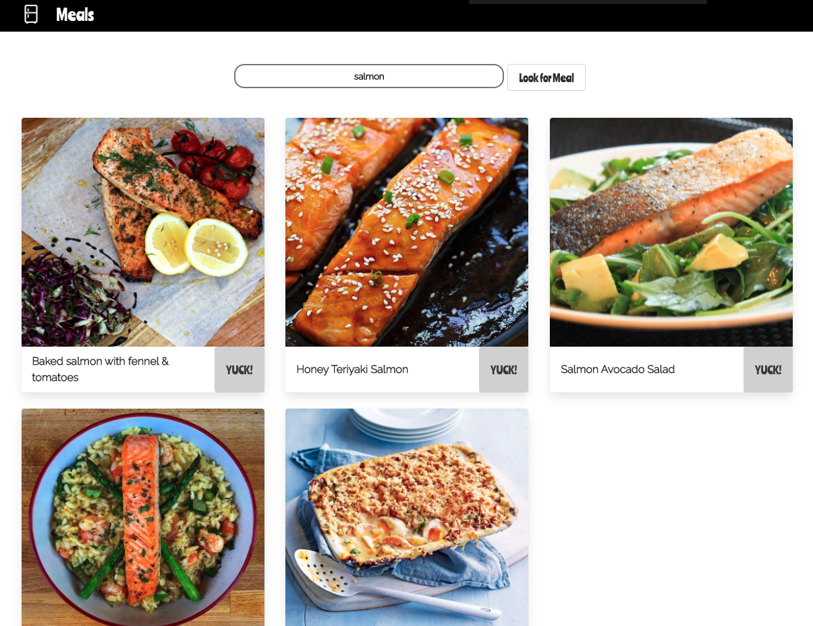

# Project 2 - Whats in Your Fridge?

## GA SEI Project 2: React App

You can find a hosted version of our App here : [What’s In Your Fridge?](https://whatsinyafridge.netlify.app/)

## Collaborator:

Tobi Lesi - [Github](https://github.com/olulesi)

## Overview

This was my second project on the General Assembly Software Engineering Immersive course.  As a pair, we were given 48 hours to build a React.js application of our choice, which consumed a public API and used RESTful routes.

The idea of our App is to help users find recipes based on the food that they have in their fridge. Users can search the main ingredient that they have (eg. ‘chicken’, ‘pork’ etc.) and are given a set of recipes to choose from which contain that ingredient. 

This Readme will outline the approach I took and the wins and challenges that I encountered along the way.

## Brief

The App should:

* **Consume a public API** – this could be anything but it must make sense for your project.
* **Have several components** - At least one classical and one functional.
* **The app should include a router** - with several “pages”.
* **Include wireframes** - that you designed before building the app.
* **Be deployed online** and accessible to the public.

## Timeframe and Technologies Used

**Timeframe**: 48 hours

**Front End:**

* JavaScript ES6
* React.js
* HTML5 & CSS3 with Animation
* SASS
* Bulma
* Npm 
* Axios / React-router-dom

**Dev Tools:**

* Insomnia
* VSCode
* Eslint
* Git
* GitHub & Github Pages
* Google Chrome Dev Tools
* Google Fonts

## Features

* Homepage
* Index of all recipes
* Search or filter by main ingredient available
* Detail page for each recipe with link to similar recipes (which include that same ingredient or are in the same category)
* 'Yuck' feature - to remove unappetising recipes
* 'My fridge is full' button which is similar to the ‘I’m Feeling Lucky’ feature and takes you to a random recipe 
* 'No meals found' page

## Approach Taken

* We started by brainstorming ideas - realising that we both had an interest for food and cooking we decided to build a recipe searching App. After researching food-based APIs, we decided to use MealDb which seemed to have relatively straightforward documentation and multiple recipes available (which could be searched by ingredient or category). Given that some of the recipes available were slightly unappetising, we decided to take a slightly comical approach - (hence the homepage photo) and the ‘yuck’ button available on each recipe card to remove that recipe from the search results. 
* Happy with how we were going to access the information from the API, we moved onto setting up the different pages and the RESTful routes.
* We then styled up our App, using Bulma and our own styling. 

## Screen Shots
**Landing Page**

**Filter by Ingredient**

**Recipe Page**

## Challenges

* A main challenge was finding a suitable API to use. We soon discovered that lots of API’s required a payment plan to access full features and that others had complex and difficult documentation to understand. We decided that choosing an API which was simple to understand was the best option, even if that meant the quality of the recipes was not as high as intended.
* The timeframe was also a challenge and we had to make sure we were not too ambitious with our planning. 

## Wins
* The project was invaluable in terms of pair programming and being able to share and learn with my partner. It was great to swap skills and learn from each-other. 
* I think we managed to achieve a lot in the small timeframe that we had and I was happy with both the functionality and styling.

## What I learned
* How to use a public API
* How to build a React App, using RESTful routes
* Pair programming - benefits of sharing skills and learning from one another
* Time management in order to reach MVP within the short timeframe

## Future Features

* If I had more time I would like to improve the ‘Yuck’ functionality - instead of making the display ‘none’ I would remove the item from the array and this would therefore fix the bug where the styling goes a bit off when you click the yuck button but we ran out of time to achieve this.